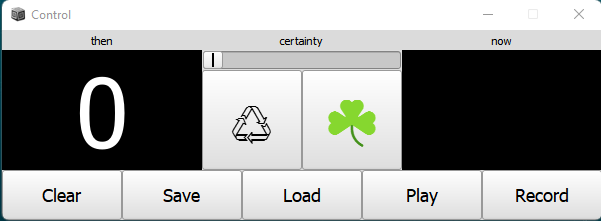

# Generative strategy
Mixed generative/interactive strategy
- Figures are generated within a set of constraints on scale degrees, note durations, and note velocities
- Occasionally a new figure is generated (8 or 16 beats randomly selected). Figures crossfade by a small amount on change.
- Using the GUI, the user can cause the system to remember a figure for reuse
- Using the GUI, the user can determine the probability that the next figure will be reused from the remembered figures or generated. If a remembered figure is used, it is selected at random (assuming there is more than 1).
- If the user has turned the probablility up to 100% reused, they can still use a control on the GUI to cause the next figure to be generated at random.

A test file test.scd is included to demonstrate loading and to illustrate the data structure that gets saved.

Four code blocks at the top of the source file indicate how/where to customize the generative algorithm.

# Sample of the GUI

When the Record button is pressed it changes to Stop Recording, and when the Play button is pressed it changes to Stop. Pressing the Stop button changes it to Stopping and disables it while the system takes some time to clean up and release resources before changing back to Play and being re-enabled. 
